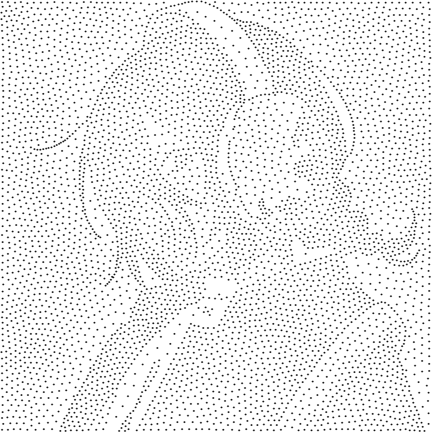

# Stipple? Ew.


> A fragmented world, creation of the afterworld, is inevitable. Dear Pathfinder, help the world as you told your stories.

StippleMeThis is a C++ image stippling program that benchmarks multiple Lloyd's Algorithm implementations: serial CPU, SIMD-assisted CPU, OpenMP CPU parallelization, and optional CUDA GPU acceleration.

---

## Examples
### Before


### After


## Implemented Features

| Feature | Status | Notes |
|---|---:|---|
| Image input | Implemented | Uses OpenCV to read images from paths such as `test/in/1.jpg`. |
| Final stipple image output | Implemented | Writes rendered stipple images to paths such as `test/out/result.png`. |
| Lloyd's Algorithm | Implemented | Uses iterative Voronoi centroid relaxation. |
| Serial backend | Implemented | Baseline CPU implementation. |
| Serial + SIMD backend | Implemented | Uses compiler-directed SIMD in the nearest-point search. |
| OpenMP backend | Implemented | CPU parallelization over pixels with per-thread accumulation buffers. |
| OpenMP + SIMD backend | Implemented | Combines OpenMP pixel parallelism with SIMD nearest-point search. |
| CUDA backend | Implemented, optional | Builds only with `-DSTIPPLE_ENABLE_CUDA=ON`; requires CUDA Toolkit and working NVIDIA driver. |
| `--mode all` | Implemented | Runs all backends and writes one comparison report. |
| Benchmark reports | Implemented | Every normal run writes a `.txt` report to `test/compare/`. |
| MP4 animation | Implemented | Uses OpenCV `VideoWriter`; enabled with `--animation`. |
| Qt6 GUI | Implemented, optional | Builds with `-DSTIPPLE_ENABLE_GUI=ON`. |
| CUDA environment checker | Implemented | `script/check_cuda.sh` checks `nvcc`, CUDA path, and driver visibility. |

---

## How the Algorithm Works with Voronoi / Lloyd's Algorithm

The program uses Lloyd's Algorithm to move points into positions that represent the image tone distribution.

High-level flow:

```text
Input image
    ↓
Convert image brightness into an internal weight map
    ↓
Initialize stipple points
    ↓
Repeat Lloyd iteration:
    1. For every pixel, find the nearest stipple point
    2. This forms Voronoi cells around the points
    3. For each Voronoi cell, compute its weighted centroid
    4. Move the point toward that centroid
    5. Stop after max iterations or when movement < epsilon
    ↓
Render final points as black dots
```

### Voronoi idea

Each stipple point owns the pixels closest to it. This region is its Voronoi cell.

```text
Point A owns pixels closest to A
Point B owns pixels closest to B
Point C owns pixels closest to C
```

During each iteration, the algorithm computes the weighted center of each region and moves the point there. Darker or more important image regions pull points more strongly, so more dots eventually gather in those areas.

### Why multiple backends exist

The expensive step is nearest-point search:

```text
for every pixel:
    compare against every point
```

That cost is roughly:

```text
image_width × image_height × point_count × iterations
```

So the project compares:

| Backend | Parallel strategy |
|---|---|
| `serial` | Single-threaded baseline. |
| `serial-simd` | Single-threaded, SIMD-assisted nearest-point search. |
| `openmp` | Multiple CPU threads process pixels in parallel. |
| `openmp-simd` | OpenMP threads + SIMD nearest-point search. |
| `cuda` | GPU threads process pixels in parallel. |

---

## Requirements

### Required for normal CLI build

- CMake `3.20+`
- C++17 compiler
- OpenCV with these components:
  - `core`
  - `imgcodecs`
  - `imgproc`
  - `videoio`
- OpenMP-capable compiler for OpenMP modes

### Optional for CUDA

- NVIDIA GPU
- Working NVIDIA driver
- CUDA Toolkit with `nvcc`

Check with:

```bash
nvidia-smi
nvcc --version
```

### Optional for GUI

- Qt6 Widgets

CMake package required:

```cmake
Qt6::Widgets
```

---

## Current Hardware / CUDA Constraint

CUDA requires an NVIDIA GPU that is visible to the operating system through a working NVIDIA driver.

On the current development system, CUDA Toolkit and `nvcc` can be installed and the CUDA backend can compile, but CUDA execution is not available because the system only exposes Intel integrated graphics:

```text
Intel Corporation Alder Lake-P GT1 [UHD Graphics]
```

No NVIDIA GPU is currently visible to the OS, and `nvidia-smi` cannot communicate with an NVIDIA driver. Because of that, this project can build CUDA code, but `--mode cuda` cannot run successfully on this machine until an NVIDIA GPU and working NVIDIA driver are available.

In short:

| CUDA requirement | Current status |
|---|---|
| CUDA Toolkit / `nvcc` | Available when installed at `/opt/cuda` |
| NVIDIA GPU | Not visible; only Intel UHD Graphics is exposed |
| NVIDIA driver runtime | Not working / unavailable |
| CUDA backend compile | Possible |
| CUDA backend execution | Not possible on the current exposed hardware |

---

## Preparation of CUDA

CUDA support is optional. The normal build uses `src/logic/cuda.cpp`, which is a safe fallback that reports CUDA as unavailable. The CUDA build uses `src/logic/cuda.cu`.

### 1. Check CUDA environment

From the project root:

```bash
./script/check_cuda.sh
```

Expected good signs:

```text
CUDA_HOME inferred:    /opt/cuda
nvcc:                  /opt/cuda/bin/nvcc
Cuda compilation tools, release ...
```

Also check the NVIDIA driver:

```bash
nvidia-smi
```

If `nvcc` works but `nvidia-smi` fails, the CUDA Toolkit is installed but the NVIDIA driver/runtime is not working.

### 2. Optional shell exports

If CUDA is installed at `/opt/cuda`, add this to your shell config if needed:

```bash
export CUDA_HOME=/opt/cuda
export CUDAToolkit_ROOT=/opt/cuda
export PATH=/opt/cuda/bin:"$PATH"
export LD_LIBRARY_PATH=/opt/cuda/lib64:"${LD_LIBRARY_PATH:-}"
```

Or ask the helper script to print exports:

```bash
./script/check_cuda.sh --export
```

Apply them with:

```bash
eval "$(./script/check_cuda.sh --export)"
```

### 3. Build CUDA backend

For this project, this command is the safest if `nvcc` is at `/opt/cuda/bin/nvcc`:

```bash
cmake -S . -B build-cuda \
  -DSTIPPLE_ENABLE_CUDA=ON \
  -DCMAKE_CUDA_COMPILER=/opt/cuda/bin/nvcc \
  -DCUDAToolkit_ROOT=/opt/cuda

cmake --build build-cuda
```

Run CUDA mode:

```bash
./build-cuda/stipple \
  --input test/in/1.jpg \
  --output test/out/1-cuda.png \
  --points 5000 \
  --iterations 30 \
  --mode cuda
```

Run all modes from the CUDA-enabled build:

```bash
./build-cuda/stipple \
  --input test/in/1.jpg \
  --output test/out/1-all.png \
  --points 5000 \
  --iterations 30 \
  --mode all
```

---

## How to Run

### Build the normal CLI

```bash
cmake -S . -B build
cmake --build build
```

### Run simple command

```bash
./build/stipple \
  --input test/in/1.jpg \
  --output test/out/1-openmp-simd.png \
  --points 5000 \
  --iterations 30 \
  --mode openmp-simd
```

Every normal run writes a timestamped report to `test/compare/`.

Example report name:

```text
test/compare/compare-1-openmp-simd-YYYYMMDD-HHMMSS.txt
```

### Run all backends

```bash
./build/stipple \
  --input test/in/1.jpg \
  --output test/out/1-all.png \
  --points 5000 \
  --iterations 30 \
  --seed 42 \
  --mode all
```

This produces per-mode outputs:

```text
test/out/1-all-serial.png
test/out/1-all-serial-simd.png
test/out/1-all-openmp.png
test/out/1-all-openmp-simd.png
test/out/1-all-cuda.png
```

And a comparison report:

```text
test/compare/compare-1-all-YYYYMMDD-HHMMSS.txt
```

### Run with animation

```bash
./build/stipple \
  --input test/in/1.jpg \
  --output test/out/1-openmp-simd.png \
  --points 5000 \
  --iterations 30 \
  --mode openmp-simd \
  --animation test/out/1-openmp-simd.mp4
```

### Build and run Qt6 GUI

```bash
cmake -S . -B build-gui -DSTIPPLE_ENABLE_GUI=ON
cmake --build build-gui
./build-gui/stipple_gui
```

If Qt6 is installed in a custom location:

```bash
cmake -S . -B build-gui \
  -DSTIPPLE_ENABLE_GUI=ON \
  -DCMAKE_PREFIX_PATH=/path/to/qt6

cmake --build build-gui
./build-gui/stipple_gui
```

The GUI provides fields for input path, output path, backend, point count, iterations, epsilon, seed, optional animation path, and a popup notification when the run finishes or fails.

### Available CLI Options

| Option | Required | Default | Description |
|---|---:|---|---|
| `--input PATH` | Yes | none | Input image path. Recommended location: `test/in/`. |
| `--output PATH` | Yes for normal use | `stipple.png` | Output stipple image path. Recommended location: `test/out/`. |
| `--points N` | No | `1000` | Number of stipple points. Higher values represent the image better but run slower. |
| `--iterations N` | No | `20` | Maximum Lloyd iterations. More iterations improve convergence but run slower. |
| `--epsilon VALUE` | No | `0.001` | Early stop threshold based on average point movement. |
| `--seed N` | No | `42` | Random seed for reproducible point initialization. |
| `--mode MODE` | No | `serial` | Backend mode: `serial`, `serial-simd`, `openmp`, `openmp-simd`, `cuda`, or `all`. |
| `--animation PATH` | No | none | Writes MP4 animation. With `--mode all`, mode names are appended to the animation filename. |
| `--compare-dir PATH` | No | derived or `test/compare` | Directory for text reports. |
| `--help` | No | none | Prints help text. |

---

## Benchmark

Benchmark reports are stored in:

```text
test/compare/
```

Use `--mode all` to generate a comparison report:

```bash
./build/stipple \
  --input test/in/1.jpg \
  --output test/out/1-all.png \
  --points 5000 \
  --iterations 30 \
  --seed 42 \
  --mode all
```

For a CUDA-inclusive benchmark, first configure the CUDA build, then run `--mode all` from `build-cuda/stipple`:

```bash
cmake -S . -B build-cuda \
  -DSTIPPLE_ENABLE_CUDA=ON \
  -DCMAKE_CUDA_COMPILER=/opt/cuda/bin/nvcc \
  -DCUDAToolkit_ROOT=/opt/cuda

cmake --build build-cuda

./build-cuda/stipple \
  --input test/in/1.jpg \
  --output test/out/1-all-cuda-build.png \
  --points 5000 \
  --iterations 30 \
  --seed 42 \
  --mode all
```

### Current preliminary CPU reports

The current reports in `test/compare/` were generated before CUDA was configured, so they should be treated as CPU-only preliminary comparisons:

```text
test/compare/compare-1-all-20260817-193524.txt
test/compare/compare-2-all-20260817-194900.txt
```

Both reports used:

```text
points:     5000
iterations: 30
epsilon:    0.001
seed:       42
mode:       all
```

### Preliminary report: `compare-1-all-20260817-193524.txt`

Input:

```text
test/in/1.jpg
```

| Mode | Status | Iterations | Final avg movement | Time |
|---|---:|---:|---:|---:|
| `serial` | passed | 30 | `0.0914455` | `368182 ms` |
| `serial-simd` | passed | 30 | `0.0914455` | `209289 ms` |
| `openmp` | passed | 30 | `0.0916324` | `52286 ms` |
| `openmp-simd` | passed | 30 | `0.0916324` | `25085 ms` |
| `cuda` | not measured | - | - | CUDA was not configured for this report |

### Preliminary report: `compare-2-all-20260817-194900.txt`

Input:

```text
test/in/2.jpg
```

| Mode | Status | Iterations | Final avg movement | Time |
|---|---:|---:|---:|---:|
| `serial` | passed | 30 | `0.042288` | `311934 ms` |
| `serial-simd` | passed | 30 | `0.042288` | `175922 ms` |
| `openmp` | passed | 30 | `0.0425147` | `44989 ms` |
| `openmp-simd` | passed | 30 | `0.0425147` | `21479 ms` |
| `cuda` | not measured | - | - | CUDA was not configured for this report |

### Benchmark Notes

- `openmp-simd` is currently the fastest validated CPU mode in the available preliminary reports.
- `serial-simd` is faster than `serial`, showing that SIMD helps the nearest-point search.
- CUDA benchmark results should be regenerated only on a system with a visible NVIDIA GPU and working NVIDIA driver.
- On the current development system, CUDA execution is constrained because only Intel UHD Graphics is exposed, so CUDA mode cannot run even if `nvcc` is installed.
- Use the same `--input`, `--points`, `--iterations`, and `--seed` when comparing modes.

---

## Code Structure

```text
stipple/
├── asset/
│   └── mv.png
├── docs/
│   └── README.md
├── include/stipple/
│   ├── animation.hpp
│   ├── config.hpp
│   ├── image.hpp
│   ├── lloyd.hpp
│   ├── point.hpp
│   ├── renderer.hpp
│   └── logic/
│       ├── cuda.hpp
│       ├── openmp.hpp
│       ├── serial.hpp
│       └── simd.hpp
├── script/
│   └── check_cuda.sh
├── src/
│   ├── main.cpp
│   ├── gui.cpp
│   ├── animation.cpp
│   ├── config.cpp
│   ├── image.cpp
│   ├── lloyd.cpp
│   ├── point.cpp
│   ├── renderer.cpp
│   └── logic/
│       ├── serial.cpp
│       ├── openmp.cpp
│       ├── simd.cpp
│       ├── cuda.cpp
│       └── cuda.cu
├── test/
│   ├── in/
│   ├── out/
│   └── compare/
├── CMakeLists.txt
└── README.md
```
---
## Constraints

I cannot run CUDA because only Intel UHD Graphics is exposed to the OS, and `nvidia-smi` cannot communicate with a working NVIDIA driver.

---
## AI Usage
You can accesss my old prompt [here](https://drive.google.com/drive/folders/1Ro0c7l_DagV1EnXlTGsMdG5908Sry5fH?usp=sharing).

---

## References

- SIMD: https://medium.com/@anilcangulkaya7/what-is-simd-and-how-to-use-it-3d1125faac89
- Example Mosaic Implementation: https://github.com/Qinzhizhou/Image-Mosaic-Process-CUDA-OpenMP
- Voronoi: https://www.cs.ubc.ca/labs/imager/tr/pdf/secord.2002b.pdf
